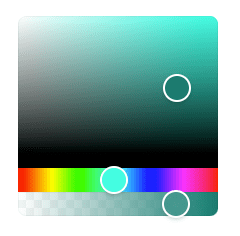

# Qodly Color Input

Qodly Color Input is a lightweight component designed to facilitate color selection within your application. With a simple interface and seamless integration, it offers a hassle-free solution for incorporating color picking functionality.

## features

**Easy Integration:** Simply bind the component to a dataSource to enable color selection.
**Visual Color Picker:** Users can easily select colors using the intuitive color picker interface.
**Manual Input Option:** Need to paste or type a specific color? You can also bind a text input field to the same dataSource, ensuring flexibility in color selection methods.

## How to paste or type a color?

If you need to input a color manually, follow these steps:

- Add a text input field to your application.
- Bind the text input field to the same dataSource as the color picker component.
- Any changes made in the text input field will automatically update the color value in the color picker component.
